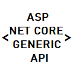
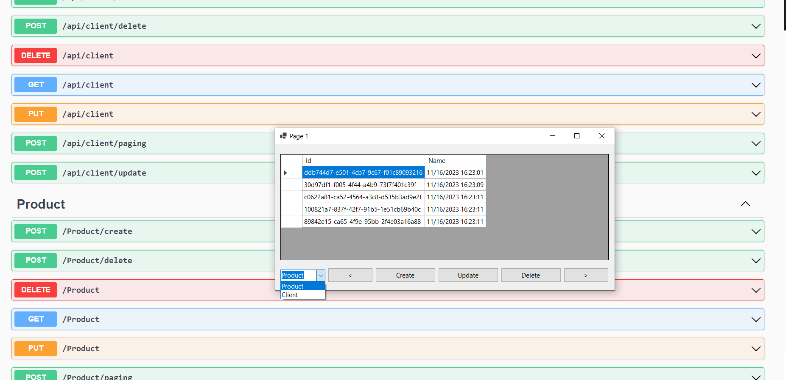

# GenericApiNetCore

# Demo

# Description
Create CURD api for aspnet core 6.0 quickly:
```
public interface IApiMethods<T>
{
    Task<IApiResult<List<T>>> CreateAsync(CreateRequest<T> entitysRequest);
    Task<IApiResult<List<T>>> UpdateAsync(UpdateRequest<T> entitysRequest);
    Task<IApiResult<List<T>>> PagingAsync(PagingRequest<T> pageRequest);
    Task<IApiResult<int>> DeleteAsync(DeleteRequest<T> idsRequest);
}
```
# How to use
## A. Server API
1. Install Package ```GenericApiNetCore.Server```

    ```
    PM> Install-Package GenericApiNetCore.Server
    ```
2. Define you Entity model

    ```
    //[ApiInfoRequest("api/product")]
    public class Product
    {
        public Guid Id { get; set; } = Guid.NewGuid();
        public string? Name { get; set; } = DateTime.Now.ToString();
    }
    ```
3. Implement method for IRepositoryMethods<Product>

    ```
    public abstract class RepositoryMethods<T> : IRepositoryMethods<T>
    {
        readonly List<T> entities = new List<T>();

        public async Task<List<T>> CreateAsync(List<T> entitysRequest)
        {
            entities.AddRange(entitysRequest);
            return entitysRequest;
        }

        public async Task<int> DeleteAsync(Guid[] idsRequest)
        {
            entities.RemoveAll(q => idsRequest.Contains(GetId(q)));
            return idsRequest.Length;
        }

        public abstract Guid GetId(T entity);

        public async Task<List<T>> PagingAsync(int pageRequest)
        {
            return entities.Skip((pageRequest - 1) * 5).Take(pageRequest * 5).ToList();
        }

        public async Task<List<T>> UpdateAsync(List<T> entitysRequest)
        {
            await DeleteAsync(entitysRequest.Select(q => GetId(q)).ToArray());
            await CreateAsync(entitysRequest);
            return entitysRequest;
        }
    }
    ```

    ```
    public class ProductRepositoryMethods : RepositoryMethods<Product>
    {
        public override Guid GetId(Product entity) => entity.Id;
    }
    ```
4. Config Dependency injection ```Program.cs```

    ```
    builder.Services.AddSingleton<IRepositoryMethods<Product>, ProductRepositoryMethods>();
    ```

5. Create api

    ```
    using GenericApiNetCore.Samples.Entities;
    using GenericApiNetCore.ServerLib;
    using Microsoft.AspNetCore.Mvc;

    namespace GenericApiNetCore.WebApi.Controllers
    {
        [RouteGeneric(typeof(Product))]
        public class ProductController : GenericControllerBase<Product>
        {
            public ProductController(IRepositoryMethods<Product> repositoryMethods) : base(repositoryMethods)
            {
            }

        }
    }

    ```


## B. Client call API
Just call api service
```
using GenericApiNetCore.ClientLib;
using GenericApiNetCore.Samples.Entities;

var baseAddress = new Uri("https://localhost:7013/");
using var client = new ClientApiMethod<Product>(baseAddress);
var data = await client.PagingAsync(new PagingRequest<Product>() { Payload = 1 });
return data;
```